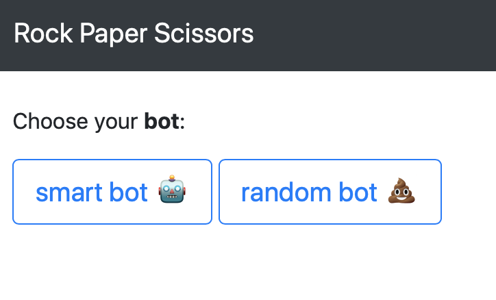
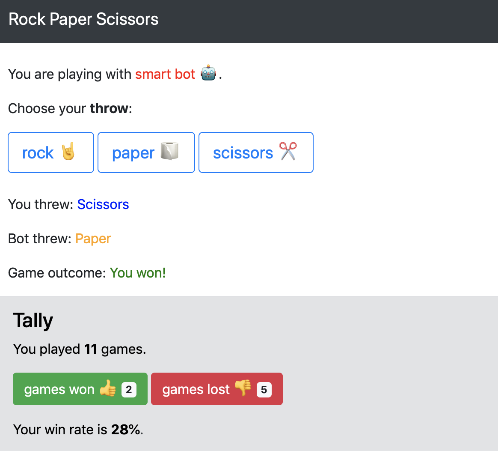

# rock_paper_scissors_bot
An intelligent rock paper scissor bot that can play with humans via a web app built on Flask, and which learns the specific playing style of it's opponents.

The bot was built atop two components:
- A machine learning algorithm trained on a rock paper scissor dataset with some 400,000 observations, that predicts what the next move of a human player will be based on the outcome of the previous game, previous throws of the human player and the combination of throws by both parties.
- A Markov chain model, by which the bot estimates it's specific opponent's moves based on his or her transition probabilities from one throw to the next. For example, assume a player has played paper after scissors once, rock after scissors twice and paper after scissors once. If the player throws scissors in the present round, the probability of them throwing paper, rock and scissors respectively in the next round according to the Markov Chain paradigm are as follows: 1/4, 2/4, 1/4. 

Players are encouraged to compare the performance of the intelligent bot with the random bot which picks rock, paper or scissors with 1/3 probability.

